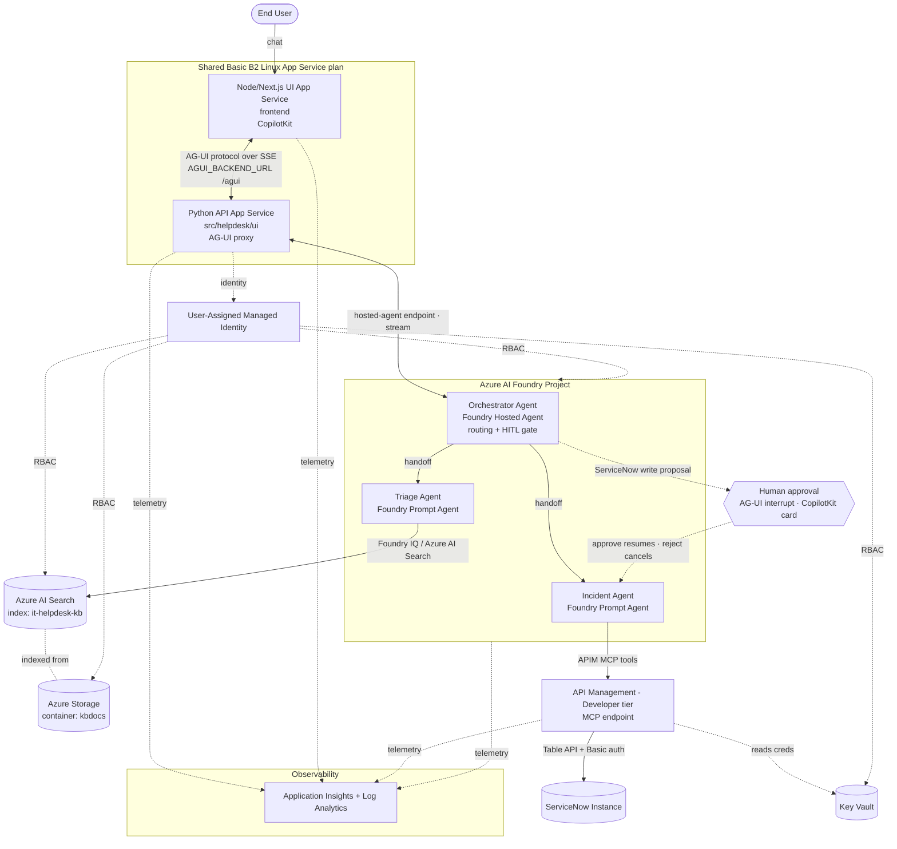

# Architecture — ServiceNow IT Helpdesk AI Agent (Azure Solution Accelerator)

> **Source of truth.** The team codes against this document. Cross-component
> contracts (Bicep outputs, azd inputs, module signatures) change here first,
> with Morpheus (Lead) approval.

## 1. What we're building

A one-click (`azd up`) Azure Solution Accelerator for a **ServiceNow ticketing AI
agent**. End users chat with a CopilotKit/Next.js UI; that UI calls a Python
AG-UI backend, which invokes a Foundry Hosted **Orchestrator** agent. The
Orchestrator routes requests through specialist agents that (1) try to resolve
from a knowledge base, and (2) if unresolved, create/assign/check/update a
ServiceNow incident behind a human-approval gate.

**Languages:** Python backend/agents + Node 22/Next.js frontend. **Tests:** pytest
and frontend build/lint. **IaC:** Bicep via `azd`.
**ServiceNow instance:** supplied by the deployer at `azd up` time (required input; not stored in this repo).

## 2. Component diagram



All resources live in **one resource group** (`rg-<environmentName>`), named with
a shared **resource token** (see §5). The two App Services share one Basic B2
Linux plan: `api` keeps the existing Python app name (`app-<token>`) and `ui` is
a new Node app (`app-ui-<token>`).

## 3. Data flow — the 4 user capabilities

The Orchestrator always receives the request first and routes. Validation
prompts (from `assets/Sample-Prompts.txt`) are noted per capability.

### 3.1 Triage & resolve (KB)
1. UI → Python API (`/agui`) → Orchestrator with the user's problem statement.
2. Orchestrator → **Triage agent**.
3. Triage agent queries **Foundry IQ / Azure AI Search** (`it-helpdesk-kb`)
   grounded on the KB docs, returns resolution steps with inline citation markers.
4. Orchestrator emits a terminal `citations` side-channel; the AG-UI proxy preserves
   it and the CopilotKit UI renders `[n]` markers plus a non-clickable `Sources:`
   list.
5. If resolved → response flows back UI ← API ← Orchestrator. **Stop.** No approval
   card is shown.

### 3.2 Create & assign incident (escalation)
_Prompt: "Unable to log into Epic. Create a new incident."_
1. Triage agent finds no resolution (or the user asks to escalate) and extracts the
   **Recommended Assignment Group** from the matching KB doc.
2. Orchestrator returns a ServiceNow write proposal through AG-UI.
3. The CopilotKit UI shows a **Human approval required** card. Approve resumes the
   same AG-UI thread; reject cancels with no ServiceNow call.
4. On approval, the Orchestrator invokes the **Incident agent**.
5. Incident agent calls the **APIM MCP endpoint** → `POST /api/now/table/incident`
   with `short_description`, `description`, `assignment_group`, urgency/impact.
6. Returns the new incident number to the user.

### 3.3 Check ticket status
_Prompt: "lookup details for incident INC0000057"_
1. Orchestrator → Incident agent.
2. Incident agent calls APIM MCP → `GET /api/now/table/incident?sysparm_query=number=INC0000057`.
3. Returns state, assignment, notes.

### 3.4 Update ticket
_Prompt: "update urgency for INC0010027 to low"_
1. Orchestrator returns an update proposal through AG-UI.
2. The CopilotKit UI shows a **Human approval required** card. Approve resumes the
   same AG-UI thread; reject cancels with no ServiceNow call.
3. On approval, the Incident agent resolves number → `sys_id` (GET), then `PATCH
   /api/now/table/incident/{sys_id}` with `urgency = 3` (low). ServiceNow enum
   mapping lives in `src/servicenow`.
4. Confirms the update.

## 4. azd input / naming contract

`azd up` prompts for **exactly** these (nothing more):

| Input | Source | azd env var | Notes |
|-------|--------|-------------|-------|
| Azure login | `az login` / azd | — | Handled by azd. |
| Subscription | azd built-in prompt | `AZURE_SUBSCRIPTION_ID` | |
| Region | azd built-in prompt | `AZURE_LOCATION` | Bicep `location`. |
| ServiceNow instance URL | `scripts/preprovision` | `SERVICENOW_INSTANCE_URL` | **Required — prompted; no default.** `https://<your-instance>.service-now.com`. |
| ServiceNow username | `scripts/preprovision` | `SERVICENOW_USERNAME` | → Key Vault secret. |
| ServiceNow password | `scripts/preprovision` | `SERVICENOW_PASSWORD` | **Secure.** → Key Vault secret; never output. |

Flow: `preprovision` hook → `azd env set …` → `infra/main.parameters.json`
(`${VAR}` substitution) → Bicep params → `keyvault.bicep` stores creds → APIM
named values reference the Key Vault secrets → managed identity reads them.
**No secret ever appears in source, outputs, or app settings in plaintext.**

## 5. Resource token & naming convention

```
resourceToken = uniqueString(subscription().id, environmentName, location)
```

Every resource: `<abbreviation><resourceToken>` (see `infra/abbreviations.json`),
except the resource group which is human-readable `rg-<environmentName>`.

| Resource | Pattern (example) |
|----------|-------------------|
| Resource group | `rg-<env>` |
| Managed identity | `id-<token>` |
| Key Vault | `kv<token>` |
| Storage | `st<token>` |
| AI Search | `srch-<token>` |
| AI Foundry account | `aif-<token>` |
| Foundry project | `proj-<token>` |
| API Management | `apim-<token>` |
| App Service plan | `plan-<token>` (Basic B2 Linux, shared) |
| Web App (API) | `app-<token>` (Python `/agui`) |
| Web App (UI) | `app-ui-<token>` (Node/Next.js CopilotKit) |
| Log Analytics | `log-<token>` |
| App Insights | `appi-<token>` |

## 6. Bicep modules & owners

`infra/main.bicep` is subscription-scoped, creates the single RG, and wires all
modules. It is **fully authored**; module bodies are **stubs** with locked
param/output signatures.

| Module | Owner | Responsibility |
|--------|-------|----------------|
| `main.bicep` | Tank (Morpheus locked) | RG, naming, wiring, outputs contract |
| `modules/monitoring.bicep` | Tank | Log Analytics + App Insights |
| `modules/identity.bicep` | Tank | User-assigned MI (all components run as) |
| `modules/keyvault.bicep` | Tank | Key Vault + ServiceNow secrets + RBAC |
| `modules/storage.bicep` | Tank | KB blob container + Blob Data roles |
| `modules/search.bicep` | Tank | AI Search service + data-plane roles |
| `modules/foundry.bicep` | Tank | Foundry account + project + model deployments |
| `modules/apim.bicep` | **Switch** (config) / Tank (resource) | Developer-tier APIM, OpenAPI import, **MCP endpoint** |
| `modules/appservice.bicep` | Tank | Shared Basic B2 plan + Python `api` Web App + Node `ui` Web App |

## 7. Bicep outputs contract (consumed by app + agents + hooks)

| Output | Consumed by |
|--------|-------------|
| `AZURE_RESOURCE_GROUP`, `AZURE_LOCATION`, `AZURE_RESOURCE_TOKEN` | azd / diagnostics |
| `AZURE_MANAGED_IDENTITY_CLIENT_ID` / `_PRINCIPAL_ID` / `_RESOURCE_ID` / `_NAME` | Python API, orchestrator, agents (auth) |
| `AZURE_KEY_VAULT_NAME`, `AZURE_KEY_VAULT_ENDPOINT` | UI, servicenow client |
| `SERVICENOW_USERNAME_SECRET_NAME`, `SERVICENOW_PASSWORD_SECRET_NAME` | APIM named values, servicenow client |
| `AZURE_AI_PROJECT_ENDPOINT`, `AZURE_AI_PROJECT_NAME`, `AZURE_AI_FOUNDRY_NAME` | Orchestrator + agents + postprovision |
| `AZURE_OPENAI_ENDPOINT`, `AZURE_OPENAI_CHAT_DEPLOYMENT`, `AZURE_OPENAI_EMBEDDING_DEPLOYMENT` | Agents + indexing |
| `AZURE_STORAGE_ACCOUNT_NAME`, `AZURE_STORAGE_BLOB_ENDPOINT`, `AZURE_STORAGE_KB_CONTAINER` | postprovision (KB upload) |
| `AZURE_SEARCH_SERVICE_NAME`, `AZURE_SEARCH_ENDPOINT`, `AZURE_SEARCH_INDEX_NAME` | Triage agent + indexing |
| `AZURE_APIM_NAME`, `AZURE_APIM_GATEWAY_URL`, `SERVICENOW_MCP_ENDPOINT` | Incident agent (`src/servicenow`) |
| `SERVICENOW_INSTANCE_URL` | servicenow client |
| `AZURE_APP_SERVICE_NAME`, `AZURE_UI_APP_SERVICE_NAME`, `AZURE_API_APP_SERVICE_NAME`, `SERVICE_API_URI`, `SERVICE_UI_URI` | azd deploy / user; API exposes `/agui`, UI is the user URL |
| `APPLICATIONINSIGHTS_CONNECTION_STRING`, `AZURE_LOG_ANALYTICS_WORKSPACE_ID` | All components (telemetry) |

## 8. Cross-component interfaces (who needs what)

- **Trinity (orchestrator + agents)** needs: `AZURE_AI_PROJECT_ENDPOINT`,
  `AZURE_OPENAI_CHAT_DEPLOYMENT`, `AZURE_OPENAI_EMBEDDING_DEPLOYMENT`,
  `AZURE_SEARCH_ENDPOINT`, `AZURE_SEARCH_INDEX_NAME`, `SERVICENOW_MCP_ENDPOINT`,
  `AZURE_MANAGED_IDENTITY_CLIENT_ID`.
- **Switch (ServiceNow/APIM)** owns: OpenAPI import + MCP exposure in
  `apim.bicep`, and the MCP client + ServiceNow field mapping in
  `src/servicenow`. Produces/consumes `SERVICENOW_MCP_ENDPOINT`.
- **Python API** needs: `AZURE_AI_PROJECT_ENDPOINT`, `AZURE_MANAGED_IDENTITY_CLIENT_ID`,
  `AZURE_OPENAI_CHAT_DEPLOYMENT`, `AZURE_SEARCH_ENDPOINT`, `AZURE_SEARCH_INDEX_NAME`,
  `SERVICENOW_MCP_ENDPOINT`, and `APPLICATIONINSIGHTS_CONNECTION_STRING`.
- **Node UI** needs: `AGUI_BACKEND_URL=https://<api-host>/agui` and
  `APPLICATIONINSIGHTS_CONNECTION_STRING`. It has no Foundry or ServiceNow secrets.
- **Dozer (tests/docs)** validates the outputs contract, the 4 data flows, and a
  fresh-clone `azd up`.

## 9. Build sequence

1. **Tank** implements Bicep modules bottom-up (monitoring → identity → keyvault
   → storage → search → foundry → apim → appservice); gets `azd provision` green.
2. **Switch** implements APIM OpenAPI import + MCP exposure + `src/servicenow`
   client in parallel (mock the endpoint until APIM exists).
3. **Trinity** implements `src/helpdesk/orchestrator`, `src/helpdesk/agents`, and the Python AG-UI
   backend in `src/helpdesk/ui`, plus the `postprovision` agent-creation +
   index-build steps, coding against the outputs contract (mock env vars until
   infra is live).
4. **Switch** implements the CopilotKit / Next.js frontend in `frontend/`, consuming
   the API through `AGUI_BACKEND_URL`.
5. **Dozer** writes pytest suites from the 4 data flows + sample prompts, frontend
   build/lint validation, and a fresh-clone deploy validation, in parallel.
6. **Morpheus** reviews at the boundaries and gates merge.

All agents can start immediately — the contracts in §4–§8 are the seams. The AG-UI/CopilotKit packages are preview pins (`agent-framework-ag-ui==1.0.0rc8`, CopilotKit next tag), so re-test the protocol before upgrading them.
