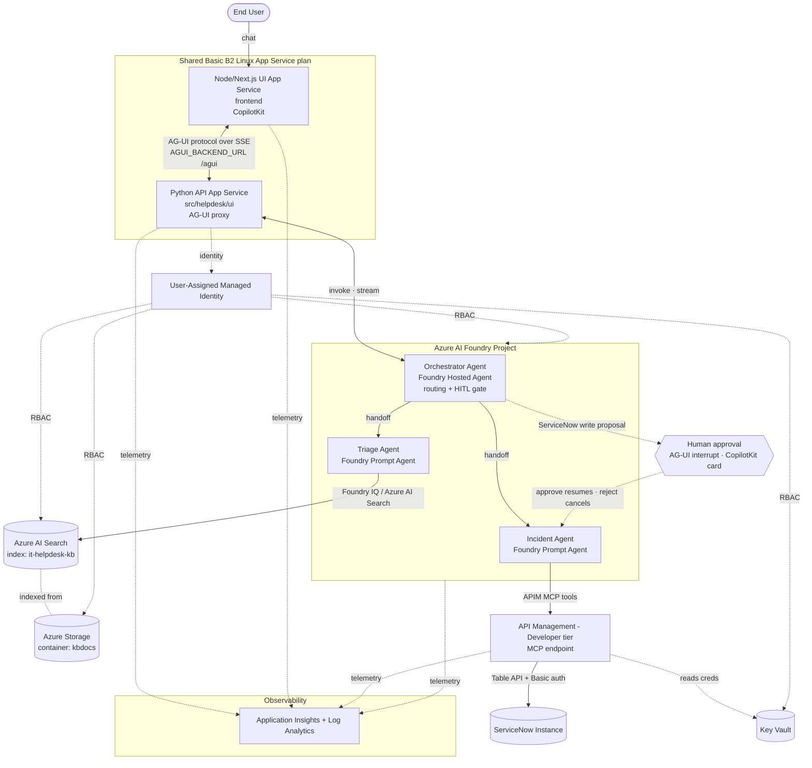

# ServiceNow IT Helpdesk AI Agent — Azure Solution Accelerator

A **one-click (`azd up`)** Azure Solution Accelerator for a **ServiceNow ticketing
AI agent**. End users chat with a **CopilotKit / Next.js** web UI. The UI calls a Python
**AG-UI** backend, which invokes a Foundry Hosted **Orchestrator** agent that
routes each request to specialist agents that (1) try to resolve it from a
knowledge base and (2) if it can't be resolved, **create / assign / check /
update** a ServiceNow incident.

Built on **Azure AI Foundry** with the **Microsoft Agent Framework** and the
pre-release **AG-UI / CopilotKit** stack (`agent-framework-ag-ui==1.0.0rc8`,
CopilotKit `1.55.2-next.1`), fronted by **Azure API Management** (which exposes
the ServiceNow Table API as MCP tools), and deployed end-to-end with the
**Azure Developer CLI (`azd`)**.

> 📐 [`ARCHITECTURE.md`](./ARCHITECTURE.md) is the source of truth for components,
> data flows, and cross-component contracts. This README is the **deploy & run**
> guide for a fresh clone.
>
> 🌐 Prefer a browsable version? Open the **[project landing page](https://abkrazy.github.io/ITHelpdesk/)** — this README and the architecture docs with a left-nav menu.

---

## What it is



### The 4 capabilities (with the sample prompts)

The three prompts in [`assets/Sample-Prompts.txt`](./assets/Sample-Prompts.txt)
exercise capabilities 2–4; capability 1 is any KB-answerable "how do I…" question.

| # | Capability | Example prompt | What happens |
|---|------------|----------------|--------------|
| 1 | **Triage & resolve from KB** | *"How do I reset my forgotten password?"* | Triage answers from the KB with steps + a citation. **No ticket is created.** |
| 2 | **Create & assign incident** | *"Unable to log into Epic. Create a new incident."* | Triage first offers confident KB troubleshooting steps; if the user confirms it is unresolved, the incident agent creates the ticket assigned to the KB assignment group. |
| 3 | **Check ticket status** | *"lookup details for incident INC0000057"* | Incident agent fetches state, urgency, and assignment group. |
| 4 | **Update ticket** | *"update urgency for INC0010027 to low"* | The UI shows a human-approval card; on approval the Incident agent resolves the number → `sys_id` and PATCHes urgency to `3` (Low). |

---

## Prerequisites (read this in full — it prevents 90% of deploy failures)

### 1. Tooling + minimum versions

| Tool | Minimum version | Check | Install |
|------|-----------------|-------|---------|
| **Azure Developer CLI (`azd`)** | 1.9.0+ | `azd version` | <https://aka.ms/azd-install> |
| **Azure CLI (`az`)** | 2.60+ | `az version` | <https://aka.ms/azure-cli> |
| **Python** | 3.11+ | `python --version` | <https://www.python.org/downloads/> |
| **Node.js** | 22.x LTS | `node --version` | <https://nodejs.org/> |
| **npm** | bundled with Node 22 | `npm --version` | <https://nodejs.org/> |
| **git** | 2.30+ | `git --version` | <https://git-scm.com/downloads> |
| **Bicep** | bundled with `az`/`azd` | `az bicep version` | `az bicep install` |

`azd` now builds and deploys **two services**: a Python AG-UI API and a
Node/Next.js CopilotKit UI. Keep **Python 3.11+**, **Node 22.x**, and **npm** on
`PATH` so Oryx/local package validation can build both.

### 2. Azure subscription + RBAC roles the deploying user needs

`infra/main.bicep` is **subscription-scoped**: `azd up` **creates the resource
group**, all resources, **and role assignments** wiring the managed identity (and
optionally you) to Key Vault, Storage, AI Search, and AI Foundry.

Creating role assignments requires `Microsoft.Authorization/roleAssignments/write`.
Therefore the deploying identity needs **one** of:

- **Owner** on the target subscription (simplest — includes RG creation + role
  assignment), **or**
- **Contributor** **plus** **User Access Administrator** (or **Role Based Access
  Control Administrator**) on the subscription.

> ⚠️ Plain **Contributor is NOT enough** — it can create the resources but will
> fail on the role assignments in `keyvault.bicep`, `storage.bicep`,
> `search.bicep`, and `foundry.bicep` with an authorization error.

**Every resource `azd up` creates** (single resource group `rg-<env>`) and the
roles it assigns:

| Resource | Azure type / SKU | Role assignments created (→ managed identity, and optionally you) |
|----------|------------------|-------------------------------------------------------------------|
| Resource Group | `rg-<environmentName>` | — (creation needs subscription rights) |
| Managed Identity | `Microsoft.ManagedIdentity/userAssignedIdentities` | The principal all other roles are granted to |
| Log Analytics + App Insights | `Microsoft.OperationalInsights/workspaces`, `Microsoft.Insights/components` | — |
| Key Vault (+ 2 secrets) | `Microsoft.KeyVault/vaults` (standard) | **Key Vault Secrets User** |
| Storage (+ `kbdocs` container) | `Microsoft.Storage/storageAccounts` (Standard, Hot) | **Storage Blob Data Contributor** |
| AI Search | `Microsoft.Search/searchServices` (**basic**) | **Search Index Data Contributor** + **Search Service Contributor** |
| **Azure AI Foundry** (+ project + 2 model deployments) | `Microsoft.CognitiveServices/accounts` (kind `AIServices`, S0) | **Azure AI Developer** + **Cognitive Services OpenAI User** (granted to the managed identity **and** optionally you) · **Cognitive Services User** (managed identity **only**) |
| **API Management** | `Microsoft.ApiManagement/service` (**Developer** tier) | — (imports the ServiceNow OpenAPI spec + MCP endpoint) |
| App Service Plan + Web Apps (API + UI) | `Microsoft.Web/serverfarms` (**Basic B2**) + 2× `Microsoft.Web/sites` | Python `api` exposes `/agui`; Node `ui` serves CopilotKit and calls `AGUI_BACKEND_URL` |

*(Role IDs are pinned in the module Bicep — e.g. `infra/modules/keyvault.bicep`,
`storage.bicep`, `search.bicep`, `foundry.bicep`.)*

### 3. Azure AI Foundry model deployment quota

`infra/modules/foundry.bicep` (via `infra/main.bicep` defaults) deploys **three
models** into the Foundry account in your chosen region:

| Model | Deployment name | SKU / type | Capacity (TPM) | Default in |
|-------|-----------------|-----------|----------------|-----------|
| **`gpt-5.4`** (orchestrator / incident chat) | `gpt-5.4` | `GlobalStandard` | **30** (30K tokens/min) | `main.bicep` `chatModelName`/`chatModelDeploymentName` |
| **`gpt-5.4-mini`** (triage chat) | `gpt-5.4-mini` | `GlobalStandard` | **30** (30K tokens/min) | `main.bicep` `triageChatModelName`/`triageChatModelDeploymentName` |
| **`text-embedding-3-large`** (embeddings) | `text-embedding-3-large` | `Standard` | **30** (30K tokens/min) | `main.bicep` `embeddingModelName`/`embeddingModelDeploymentName` |

Model **version** is not pinned; Foundry uses the current default
(`versionUpgradeOption: OnceNewDefaultVersionAvailable`).

**You must have quota for all three models, at these capacities, in your chosen
region.** To check / request:

```bash
# List available models + your quota in a region
az cognitiveservices account list-models --name <foundry> --resource-group <rg> 2>/dev/null
# Or use the Foundry / AI portal quota blade:
#   https://ai.azure.com  ->  Management center  ->  Quota
# Request more:  Azure portal -> Quotas -> Cognitive Services / Azure OpenAI
```

If quota is short, lower `capacity` (e.g. to 10) or pick a region with headroom.

### 4. Resource provider registrations

Ensure these providers are **Registered** on the subscription (portal → Subscription
→ Resource providers, or the commands below). `azd`/ARM auto-registers most, but
first-time subscriptions frequently need these three explicitly:

```bash
az provider register --namespace Microsoft.CognitiveServices
az provider register --namespace Microsoft.ApiManagement
az provider register --namespace Microsoft.Search
# Also used: Microsoft.Web, Microsoft.KeyVault, Microsoft.Storage,
#            Microsoft.OperationalInsights, Microsoft.Insights,
#            Microsoft.ManagedIdentity, Microsoft.Authorization
```

### 5. Region availability caveats

> **⚠️ The single most important choice.** The Orchestrator ships as a **Foundry
> Hosted Agent (Preview)**, which is only available in a **narrow subset** of
> regions — narrower than Prompt Agents or the base models. `infra/main.bicep`
> therefore constrains `location` (via `@allowed`) to the regions that support
> **all** required services. `azd up` will only let you pick from this list.

Pick a region that supports **all** of:

- **Foundry Hosted Agents (Preview)** — currently **East US 2, North Central US,
  Sweden Central, West US, West US 3** only. This is the binding constraint. See
  [Hosted Agents region availability](https://learn.microsoft.com/azure/foundry/agents/concepts/hosted-agents#region-availability).
  (Plain **East US is _not_ supported** for Hosted Agents, even though it supports
  Prompt Agents.)
- **`gpt-5.4` / `gpt-5.4-mini` (GlobalStandard)** and **`text-embedding-3-large` (Standard)** in
  Azure AI Foundry — see [model region availability](https://learn.microsoft.com/azure/ai-services/openai/concepts/models).
  Note: some Hosted-Agents regions (e.g. North Central US, West US) do **not**
  offer `text-embedding-3-large` on the **Standard** SKU — verify before choosing.
- **Azure AI Search `basic` SKU** — capacity in the Hosted-Agents regions is
  sometimes tight. If `azd up` fails with `ResourcesForSkuUnavailable` /
  `InsufficientResourcesAvailable` on the Search service, simply **re-run
  `azd up`** (it's idempotent and resumes) or pick another region from the list.
- **API Management Developer tier** — available in all of the above.

**Well-tested choices (required models + Hosted Agents + Search):** **Sweden Central**,
**West US 3**, **East US 2**. Check model quota and Search capacity first:

```bash
az cognitiveservices usage list --location swedencentral \
  --query "[?contains(name.value,'gpt-5.4') || contains(name.value,'gpt-5.4-mini') || contains(name.value,'text-embedding-3-large')].{name:name.value,current:currentValue,limit:limit}" -o table
```

> **Governed / policy-locked subscriptions.** Some enterprise subscriptions enforce
> an Azure Policy that forces Storage `publicNetworkAccess = Disabled`. The KB
> **grounding path is unaffected** — `postprovision` embeds `assets/kb/*` and
> pushes them straight to AI Search (whose endpoint stays public). The only thing
> such a policy blocks is the optional **archival** copy of the raw docs to Blob
> storage; `postprovision` logs a warning and continues, so `azd up` still
> succeeds and the Triage agent stays fully grounded.

When in doubt, deploy AI Foundry and APIM in the same region to avoid cross-region latency.

### 6. ServiceNow prerequisites

- A **ServiceNow instance** — use your own. A free **Personal Developer
  Instance (PDI)** works well; get one at <https://developer.servicenow.com>.
  You'll provide its base URL (`https://<your-instance>.service-now.com`) when
  prompted during `azd up` — it is **not** stored in this repo.
- A **ServiceNow user with the `itil` role** (or equivalent) — needs rights to
  **read, create, and update `incident` records** via the Table API.
- The **Table API OpenAPI spec is already provided** at
  [`assets/ServiceNow-OpenAPI-spec.json`](./assets/ServiceNow-OpenAPI-spec.json)
  and is imported into APIM automatically — you don't supply it.
- `azd up` will **prompt for** the instance URL, username, and password. The
  credentials are stored as **Key Vault secrets** and injected into APIM as
  Basic auth named values — **they never appear in source, outputs, or app
  settings in plaintext**.

### 7. Cost note (not free)

A hackathon-scale deployment is inexpensive but **not free**. Rough drivers:

- **API Management — Developer tier:** ~**$0.07/hour (~$50/month)**. Billed while
  provisioned; **also takes ~30–45 min to create** (see Troubleshooting).
- **Azure AI Foundry model usage:** pay-per-token for `gpt-5.4`, `gpt-5.4-mini`, and embeddings —
  cents for a demo, scales with traffic.
- **App Service Basic B2**, **AI Search basic**, **Storage**, **Key Vault**,
  **Log Analytics/App Insights:** a few dollars/day combined.

**Estimate:** a day-long hackathon typically costs a **few US dollars to ~$10**,
dominated by APIM's hourly charge. **Run `azd down` when done** (see Clean up).

---

## Deploy (the one-click path)

```bash
# 1. Clone
git clone <this-repo-url>
cd ITHelpdesk

# 2. Sign in (both CLIs)
azd auth login
az login          # ensures az-based operations (bicep, quota) have context

# 3. Deploy everything
azd up
```

**Prompts you'll see during `azd up`:**

1. **Environment name** — a short name; drives `rg-<name>` and the resource token.
2. **Azure subscription** — pick the one where you have Owner / UAA.
3. **Region** — pick one satisfying the model + APIM availability above.
4. **ServiceNow instance URL** — **required**; enter your instance base URL
   (`https://<your-instance>.service-now.com`). There is no default.
5. **ServiceNow username** — a user with the `itil` role.
6. **ServiceNow password** — **entered securely (never echoed)**; stored in Key Vault.

**What happens next (unattended):**

- `azd provision` runs `infra/main.bicep` — creates the RG, all resources, model
  deployments, APIM (with the ServiceNow OpenAPI import + MCP endpoint), role
  assignments, and a shared **Basic B2** Linux App Service plan with two apps:
  - `api` — Python FastAPI backend exposing AG-UI `/agui`.
  - `ui` — Node/Next.js CopilotKit frontend, wired to the API by `AGUI_BACKEND_URL`.
- `azd deploy` packages and deploys **both services** (`api` then `ui`).
- The **`postprovision` hook** (`scripts/postprovision.*`) then:
  1. **uploads the KB docs** (`assets/kb/*.md`) to the Storage `kbdocs` container,
  2. **builds the Azure AI Search index** (`it-helpdesk-kb`) over them, and
  3. **creates/refreshes the 3 Foundry agents** (orchestrator, triage, incident)
     and writes their IDs back to the azd environment. (Idempotent — safe to re-run.)

**Open the UI** — when `azd up` finishes it prints the App Service URL. You can
also fetch it any time:

```bash
azd env get-value SERVICE_UI_URI
```

Open that URL in a browser and start chatting. `SERVICE_API_URI` is the backend
health/AG-UI app; end users should use `SERVICE_UI_URI` (the Node UI).

### Human approval for ServiceNow writes

Create and update requests are gated in the CopilotKit UI with a **Human approval
required** card. Review the proposed ServiceNow payload, optionally edit the JSON,
then choose **Approve** to execute or **Reject** to cancel. Read-only turns — KB
troubleshooting and incident status lookups — do **not** show an approval card.

### Existing-environment cutover order

For a **new** azd environment, `azd up` provisions and deploys both services in one
run. For an **existing live** environment created before the two-service split, use
this safe order during a planned cutover:

```bash
# 1. Re-tag the existing Python app in place from ui -> api and create the new Node ui app.
azd provision

# 2. Deploy explicitly in service order. Do not deploy ui before provision moves the tag.
azd deploy api
azd deploy ui

# 3. Verify outputs.
azd env get-value SERVICE_API_URI
azd env get-value SERVICE_UI_URI
```

`SERVICE_API_URI` should point at the existing Python app name (`app-<token>`), and
`SERVICE_UI_URI` should point at the new Node app (`app-ui-<token>`). Switch users
to `SERVICE_UI_URI` only after both deploys pass.

---

## Validate your deployment

Run each sample prompt in the UI and confirm the result:

| Prompt | Correct result |
|--------|----------------|
| `How do I reset my forgotten password?` | KB resolution steps + a citation to **Password Reset and Login Assistance**. **No incident is created.** |
| `Unable to log into Epic. Create a new incident.` | KB login troubleshooting steps + an offer to file on confirmation, assigned to **Identity and Access Management** (pulled from `unable-to-login.md`). Reply `go ahead` if unresolved; approve the card to create the incident, or reject to cancel. |
| `lookup details for incident INC0000057` | Incident **INC0000057** details — state, urgency, assignment group. |
| `update urgency for INC0010027 to low` | A human-approval card appears first. Approve it, then confirm **INC0010027** urgency is now **Low** (ServiceNow code `3`). Rejecting cancels the update. |

> The lookup/update prompts reference example incident numbers (**INC0000057**,
> **INC0010027**) present on the reference PDI. If you connected **your own**
> ServiceNow instance, substitute incident numbers that exist there (the *create*
> flow works against any instance and gives you fresh numbers to test with).

---

## Local / mock development (no Azure required)

The whole chat flow runs offline with `HELPDESK_MOCK=1`: triage searches the local
KB (`assets/kb/*.md`) and the incident agent uses an in-memory ServiceNow mock
seeded with **INC0000057** and **INC0010027**.

```bash
# Create a venv and install runtime + dev + UI + servicenow extras
python -m venv .venv
.\.venv\Scripts\activate            # PowerShell:  .\.venv\Scripts\Activate.ps1
# macOS/Linux:  source .venv/bin/activate
pip install -e ".[dev,ui,servicenow]"

# Run the full test suite (offline)
$env:HELPDESK_MOCK = "1"            # bash/zsh:  export HELPDESK_MOCK=1
pytest

# Run the Python AG-UI API locally against the mock stack
python -m uvicorn helpdesk.ui.app:app --host 0.0.0.0 --port 8000

# In another shell, run the CopilotKit frontend against that backend
cd frontend
npm install
$env:AGUI_BACKEND_URL = "http://localhost:8000/agui"   # bash/zsh: export AGUI_BACKEND_URL=http://localhost:8000/agui
npm run dev
#   -> open http://localhost:3000
```

See [`tests/README.md`](./tests/README.md) for the full mock-vs-live testing guide.

---

## Troubleshooting

| Symptom | Likely cause | Fix |
|---------|--------------|-----|
| `azd up` fails on a role assignment (`AuthorizationFailed`, `RoleAssignmentUpdateNotPermitted`) | Deploying user lacks role-assignment rights | Grant **Owner**, or **Contributor + User Access Administrator**, on the subscription (see Prerequisites §2). |
| Model deployment fails with a quota / capacity error | No quota for `gpt-5.4`, `gpt-5.4-mini`, or `text-embedding-3-large` in the region | Request quota, lower `capacity` in `main.bicep`, or choose another region (Prerequisites §3). |
| `azd up` seems stuck for 30–45 min | **APIM Developer tier provisioning is slow (normal)** — a fresh APIM instance takes ~30–45 min to activate | Wait; it's not hung. Subsequent `azd up` runs are much faster. |
| `MissingSubscriptionRegistration` / provider not registered | First-time subscription | `az provider register` the namespaces in Prerequisites §4, then retry. |
| Model / APIM "not available in region" | Region doesn't offer that SKU/model | Redeploy to a supported region (Prerequisites §5), e.g. East US 2 or Sweden Central. |
| ServiceNow calls return **401/403** | Wrong username/password, or user lacks the `itil` role | Re-run and re-enter creds: `azd env set SERVICENOW_USERNAME …` / `SERVICENOW_PASSWORD …`, ensure `itil` role, then `azd provision`. |
| postprovision warns **KB blob upload skipped (AuthorizationFailure)** | The deployer's **Storage Blob Data Contributor** role assignment hadn't finished propagating when postprovision ran (data-plane RBAC can take a few minutes) | **Non-fatal** — the KB blob copy is archival-only; triage grounding reads `assets/kb` locally and indexes it straight into AI Search, so it still works. postprovision now retries with backoff; if it still skips, re-run `azd provision` once RBAC has propagated. |
| Foundry agent setup fails with **`cannot import name 'KnowledgeBase'`** (or another `Knowledge*`/`SearchIndex*` model) | The local Python running the postprovision hook had a drifted `azure-search-documents` — the Foundry IQ agentic-retrieval preview models live **only** in `11.7.0b2` | The postprovision hook now builds an isolated `.venv-provision/` and installs the exact pins from `scripts/requirements-postprovision.txt` before running — so the deployer's global Python version no longer matters. Just ensure **Python 3.11+** is on `PATH` and re-run `azd provision`. |
| Lookup of `INC0000057` returns "not found" against your own instance | The example incidents only exist on the reference PDI | Use real incident numbers from your instance, or create one first via the create flow. |
| UI loads but chat errors | postprovision didn't finish (no index / agents), or the Node UI cannot reach the Python API | Re-run `azd provision` (re-triggers the idempotent postprovision hook), verify `AGUI_BACKEND_URL=https://<api-host>/agui`, and check `azd env get-value SERVICE_API_URI`. |

---

## Clean up

Delete **all** provisioned resources (stops all charges, including APIM):

```bash
azd down --purge
```

`--purge` also purges soft-deleted Key Vault / Cognitive Services so the names can
be reused immediately.

---

## Repository structure

```
azure.yaml              # azd manifest: api + ui services + preprovision/postprovision hooks
ARCHITECTURE.md         # source of truth — components, data flows, contracts
BUILD_PLAN.md           # ownership + build sequence
pyproject.toml          # Python 3.11+ project + per-component extras
README.md               # this guide

infra/                  # Bicep IaC (subscription-scoped)
  main.bicep            #   RG + module wiring + outputs contract
  main.parameters.json  #   azd env -> Bicep param binding (incl. model defaults)
  abbreviations.json    #   resource-name abbreviations
  modules/              #   monitoring, identity, keyvault, storage, search,
                        #   foundry (models), apim (ServiceNow + MCP), appservice

src/
  helpdesk/
    orchestrator/       # Orchestrator router (Foundry hosted agent)
    agents/             # Triage (KB) + Incident (ServiceNow) agents, KB parsing,
                        #   search client, agent/index setup
    ui/                 # FastAPI AG-UI API backend (/agui)
    shared/             # config (azd outputs contract) + credential helpers
  servicenow/           # ServiceNow / APIM MCP client + field/enum mapping [Switch]
frontend/               # Next.js + CopilotKit customer-facing UI

scripts/                # azd hooks: preprovision (ServiceNow inputs),
                        #   postprovision (KB upload, index build, agent creation)
tests/                  # pytest suites (mock + live) — see tests/README.md
assets/                 # KB docs (kb/*.md), ServiceNow OpenAPI spec, sample prompts
```

| Folder | Purpose | Primary owner |
|--------|---------|---------------|
| `infra/` | All Azure resources (Bicep) | Tank |
| `src/helpdesk/orchestrator`, `src/helpdesk/agents`, `src/helpdesk/ui` | Agents + orchestration + AG-UI API backend | Trinity |
| `frontend/` | CopilotKit / Next.js customer UI | Switch |
| `src/servicenow/` | ServiceNow / APIM MCP integration | Switch |
| `scripts/` | azd lifecycle hooks | Tank + Trinity |
| `tests/`, docs | Test coverage + this README | Dozer |
| `ARCHITECTURE.md`, `azure.yaml` shape | Architecture & contracts | Morpheus |

---

## License

MIT — see `pyproject.toml`.


